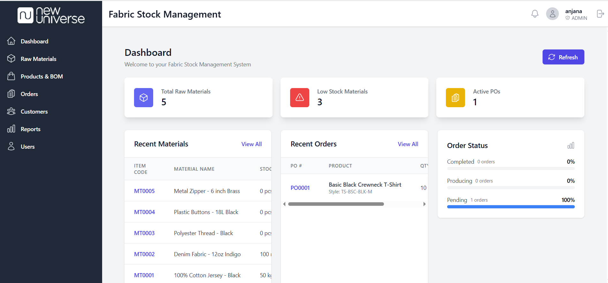
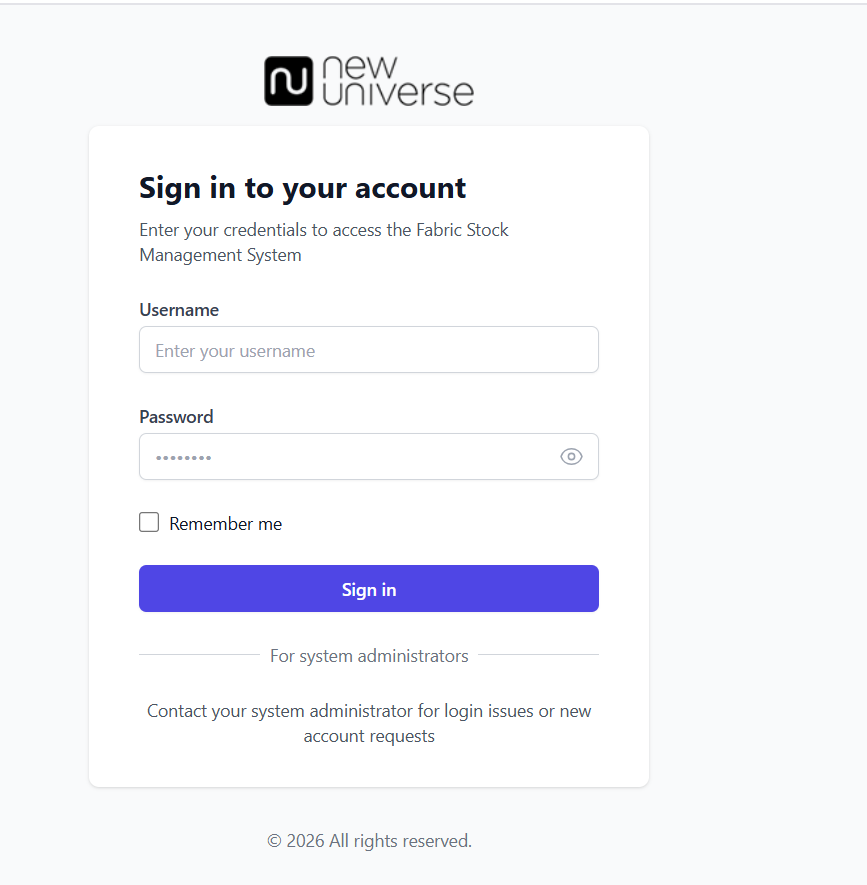
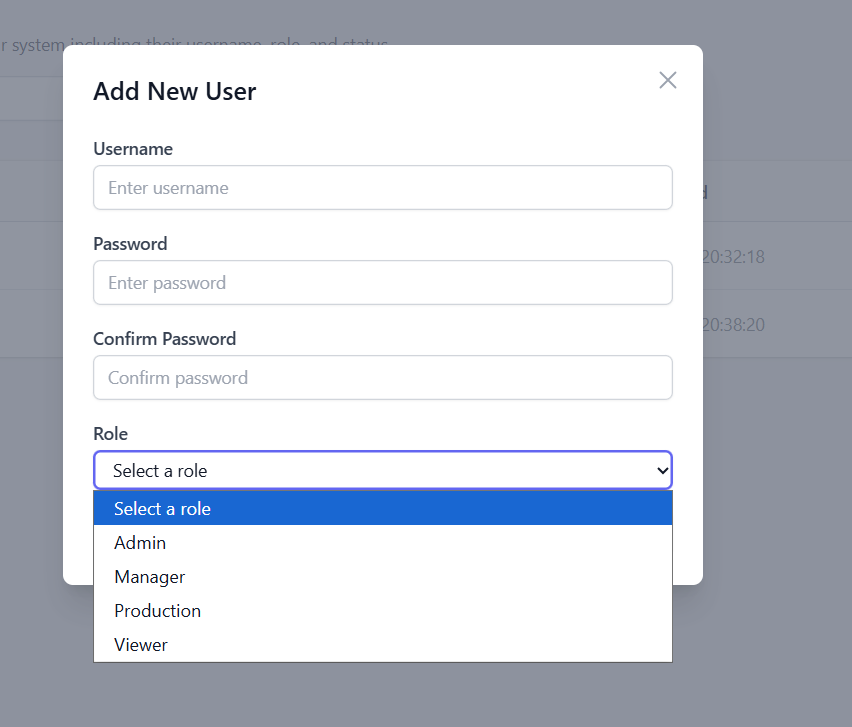
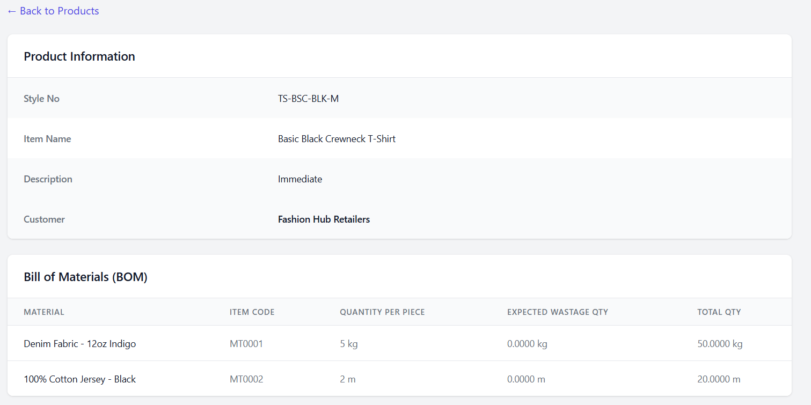
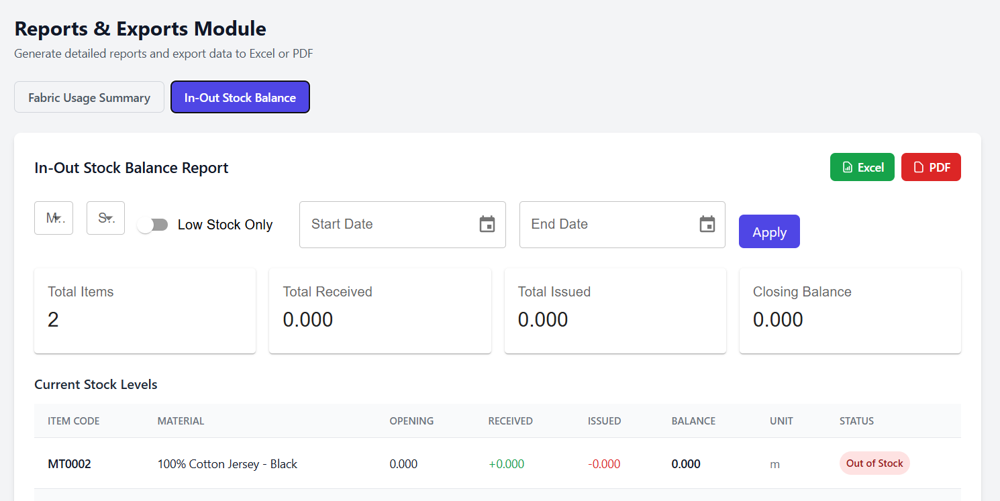
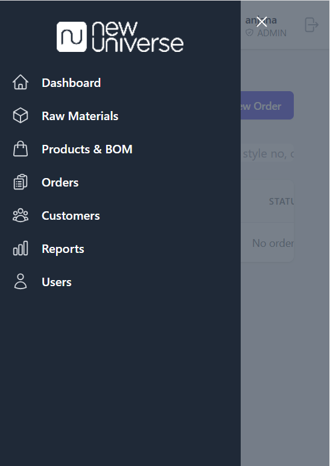
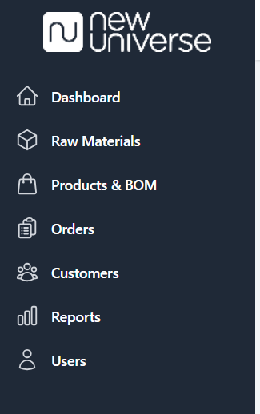

# GarmentSMS-MERN — Garment Stock Management System

## Live Demo
**URL:** [https://gsms-app.salmonocean-d578ed8b.eastus.azurecontainerapps.io](https://gsms-app.salmonocean-d578ed8b.eastus.azurecontainerapps.io)

---

## Overview

**GarmentSMS** is a full-stack **Garment Stock Management System** built for apparel manufacturing businesses. It streamlines the entire production workflow—from raw material inventory and product Bill of Materials (BOM) to purchase orders, production tracking, and reporting.

The system features **role-based access control** with four user tiers (Admin, Manager, Production, Viewer), real-time stock adjustments, wastage tracking at every production stage, and exportable reports.

---

## Screenshots

| Dashboard | Login | User Management |
|:---|:---|:---|
|  |  |  |

| BOM Configuration | Reports | Responsive Design |
|:---|:---|:---|
|  |  |  |

| Admin Panel |
|:---|
|  |

---

## Features

### Core Modules
- **Dashboard** — Real-time KPIs, recent orders, low-stock alerts, and activity feed
- **User Management** — Create, update, and manage users with role-based access (ADMIN · MANAGER · PRODUCTION · VIEWER)
- **Raw Materials** — Track inventory with batch-wise receipts, units (m, kg, pcs, yd, cm, g, roll), and material ledger history
- **Products & BOM** — Define products with style numbers and configure Bills of Materials per piece, including expected wastage percentages
- **Customers** — Manage customer records with full-text search
- **Orders** — Create purchase orders (PO), auto-calculate material requirements from BOM, track status (Pending → Producing → Completed)
- **Production Logging** — Record daily cut quantities and material usage across stages (Cutting, Sewing, Finishing), with standard vs. extra wastage tracking
- **Reports** — Generate and export reports in multiple formats (Excel & PDF)

### Technical Highlights
-  **JWT Authentication** with secure HTTP-only cookie patterns via Nginx proxy
-  **Responsive UI** built with Tailwind CSS + Material UI components
-  **Redux Toolkit** for centralized state management
-  **Swagger API Docs** available at `/api-docs`
-  **Dockerized** single-container deployment (Node + MongoDB + Nginx + Supervisor)
- **Azure Container Apps** live deployment

---

## Tech Stack

| Layer | Technology |
|-------|------------|
| **Frontend** | React 19, Vite, Tailwind CSS 3.4, Redux Toolkit, React Router v7, Material UI v7, React Hook Form, Axios |
| **Backend** | Node.js 20, Express 5, MongoDB 7, Mongoose, JWT (jsonwebtoken), bcryptjs, PDFKit, ExcelJS, Swagger |
| **DevOps** | Docker, Nginx, Supervisor, Azure Container Apps |

---

## Project Structure

```
GarmentSMS-MERN/
├── backend/GSMS-Backend/          # Express REST API
│   ├── controllers/               # Route controllers
│   ├── middlewares/               # Auth & validation middleware
│   ├── models/                    # Mongoose schemas
│   │   ├── User.js
│   │   ├── Product.js
│   │   ├── Order.js
│   │   ├── RawMaterial.js
│   │   ├── ProductionLog.js
│   │   └── Customer.js
│   ├── routes/                    # API routes
│   ├── utils/                     # Swagger docs, default admin seeder
│   ├── app.js                     # Express app config
│   └── server.js                  # Entry point
├── frontend/GSMS/                 # React SPA
│   ├── src/
│   │   ├── components/            # Reusable UI components
│   │   ├── pages/                 # Route-level pages
│   │   ├── redux/slices/          # Redux state slices
│   │   ├── routes/                # React Router setup
│   │   ├── services/              # API service layer
│   │   └── layouts/               # Auth & Dashboard layouts
│   └── index.html
├── docker/                        # Docker & deployment configs
│   ├── nginx.conf
│   ├── supervisord.conf
│   └── docker-start.sh
├── images/                        # Application screenshots
├── docs/                          # PDF documentation
├── Dockerfile                     # Multi-stage production build
├── azure-deploy.ps1               # Azure deployment scripts
└── .env.example                   # Environment variables template
```

---

## Getting Started

### Prerequisites
- [Node.js](https://nodejs.org/) v20+
- [MongoDB](https://www.mongodb.com/) v7+
- [Docker](https://www.docker.com/) (optional, for containerized run)

### 1. Clone the Repository
```bash
git clone https://github.com/AnjanaKvd/GarmentSMS-MERN.git
cd GarmentSMS-MERN
```

### 2. Environment Setup
```bash
cp .env.example .env
```
Fill in the required values:
```env
# Frontend
VITE_API_BASE_URL=http://localhost:5000/api/

# Backend
MONGO_URI=mongodb://localhost:27017/garmentsms
PORT=5000
JWT_SECRET=your_super_secret_key
DEFAULT_ADMIN_USERNAME=admin
DEFAULT_ADMIN_PASSWORD=admin123
```

### 3. Run Backend
```bash
cd backend/GSMS-Backend
npm install
npm run dev          # Uses nodemon for hot reload
```

### 4. Run Frontend
```bash
cd frontend/GSMS
npm install
npm run dev          # Runs Vite dev server
```

Visit `http://localhost:5173` (frontend) and `http://localhost:5000/api-docs` (API docs).

---

## Docker Deployment

Build and run the entire stack (Node API + MongoDB + Nginx + React build) in a single container:

```bash
docker build -t garment-sms .
docker run -p 80:80 -e JWT_SECRET=your_secret -e MONGO_URI=... garment-sms
```

The production image:
1. Builds the React frontend with Vite
2. Installs backend dependencies
3. Bundles Nginx as a reverse proxy
4. Runs MongoDB, Node API, and Nginx under Supervisor

---

## Azure Deployment

Deployment scripts are included for **Azure Container Apps**:

```powershell
# Using PowerShell
.\azure-deploy.ps1
```

Or follow your standard `az containerapp up` workflow using the provided `Dockerfile`.

---

## API Endpoints

| Route | Description |
|-------|-------------|
| `POST /api/auth/login` | Authenticate user |
| `GET /api/user` | List / manage users |
| `GET /api/materials` | Raw materials CRUD |
| `GET /api/products` | Products & BOM |
| `GET /api/orders` | Orders management |
| `GET /api/production` | Production logs |
| `GET /api/reports` | Generate reports |
| `GET /api/customers` | Customer records |
| `GET /api-docs` | Swagger UI documentation |

---

## Authentication & Roles

The system implements **JWT Bearer token** authentication. Available roles:

| Role | Permissions |
|------|-------------|
| **ADMIN** | Full system access — Users, configurations, all data |
| **MANAGER** | Manage orders, production, materials, and view reports |
| **PRODUCTION** | Create production logs and update order statuses |
| **VIEWER** | Read-only access to dashboard, materials, and orders |

---

## Data Models

### Key Entities
- **User** — `username`, `password` (bcrypt hashed), `role`, `status`
- **Product** — `styleNo`, `itemName`, `materialsRequired[]` (BOM)
- **Order** — `poNo`, `productId`, `quantity`, `status`, `consumptionReport[]`
- **RawMaterial** — `itemCode`, `name`, `unit`, `currentStock`, `receivedBatches[]`
- **ProductionLog** — `orderId`, `cutQty`, `materialUsage[]`, `status`, `wastage tracking`
- **Customer** — `name`, `country`, `description` (text-indexed for search)

---

## License

This project is licensed under the ISC License.

---

## Contributing

Contributions are welcome! Please feel free to submit a Pull Request.

1. Fork the repository
2. Create your feature branch (`git checkout -b feature/AmazingFeature`)
3. Commit your changes (`git commit -m 'Add some AmazingFeature'`)
4. Push to the branch (`git push origin feature/AmazingFeature`)
5. Open a Pull Request

---

*Built with the MERN stack and deployed on Microsoft Azure.*
